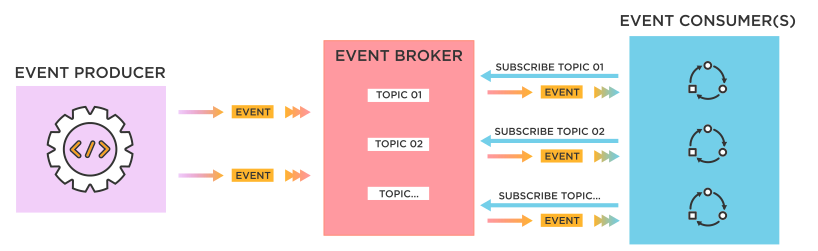

# Apache Kafka

> Apache Kafka is an open-source distributed **event streaming** platform

## Event-driven Architecture (EDA)

> BE 서버들이 실시간으로 **event**를 감지해서 반응 할 수 있도록 해주는 **소프트웨어 아키텍처 패턴** 이다. 
> event-driven 구조들 중에서 가장 유명한 디자인 패턴은 **pub/sub** 이다.

## Event Streaming & Message Queue

### Message Queue

> 초기 EDA의 형태로 message를 특정 consumer에게 보낸다. 대부분의 message broker는 FIFO(First-In, First-Out)의 순서이며 consumer 가 데이터를 받으면 즉시 또는 짧은시간 내에 데이터를 삭제한다.
>  platform: RabbitMQ, Redis Queue

- Event streaming 의 기능을 할 수 없다.

### Event Streaming

> EDA를 사용하며 비동기, 서비스간의 낮은 결합도, 쉬운 스케일업이 가능하다.
>  platform: Kafka, Amazon Kinesis

- Message queue 의 기능을 할 수 있다.
- 이벤트 레코드를 하나만 보관
- 인덱스를 통해 개별 엑세스 관리
- 필요한 시간동안 이벤트를 보존
- 장애 발생시 장애가 일어난 시점부터 재실행 가능
- 많은 양의 실시간데이터를 효과적으로 처리 가능

## Reference

- [Apache Kafka](https://kafka.apache.org/)
- [Pandio](https://pandio.com/event-streams-queues/)
- [Tibco](https://www.tibco.com/reference-center/what-is-event-driven-architecture)
