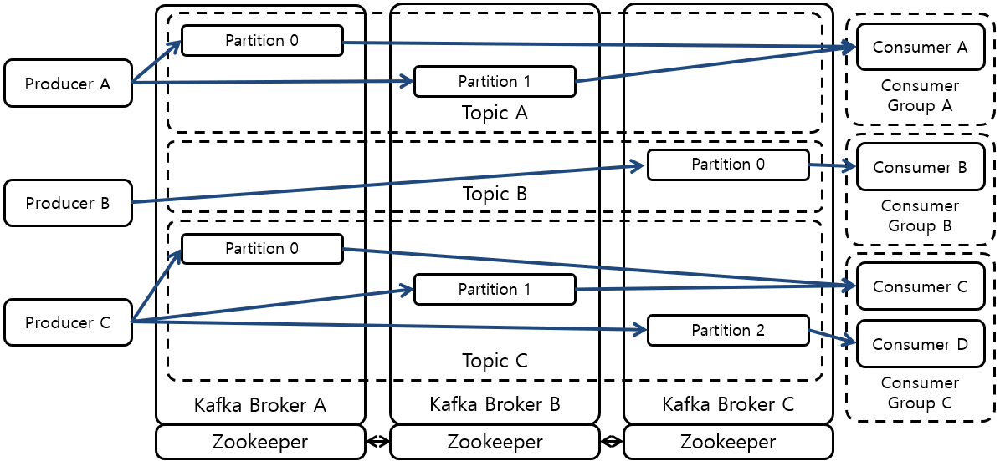
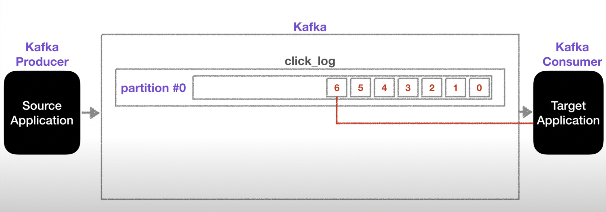
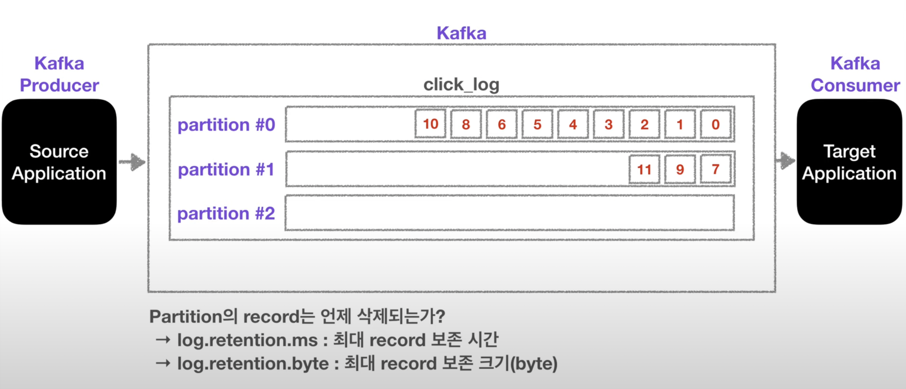
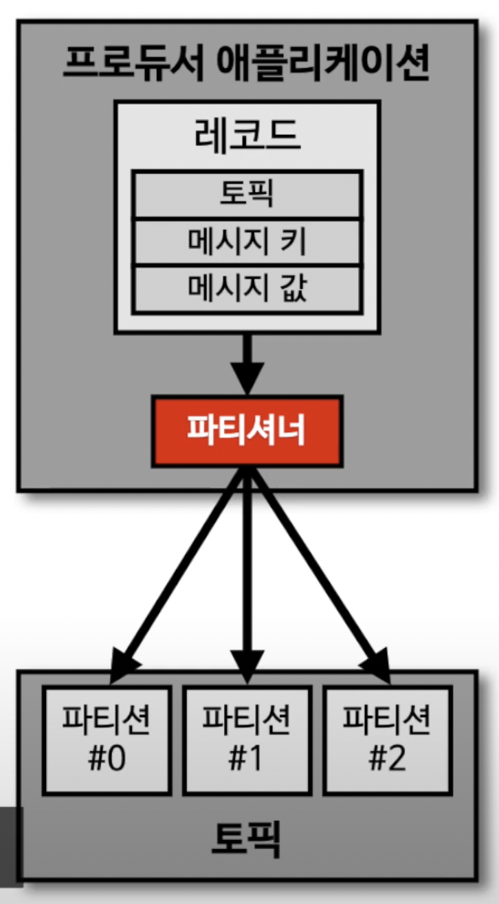
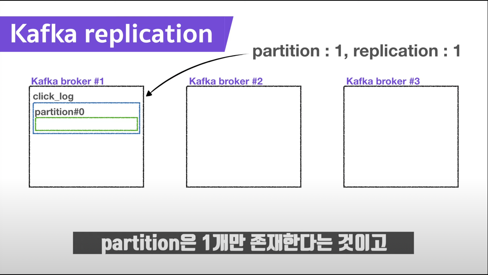
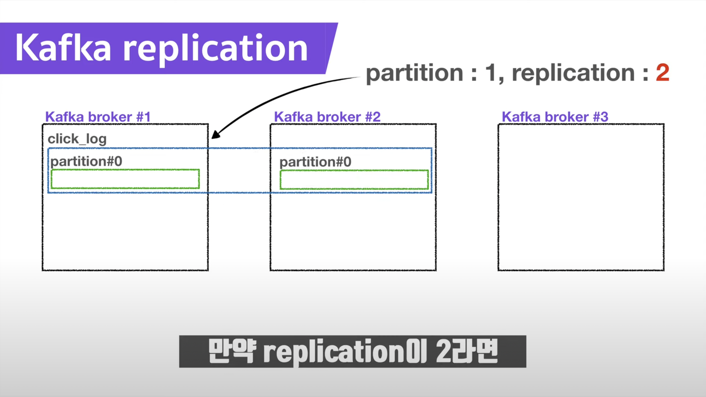
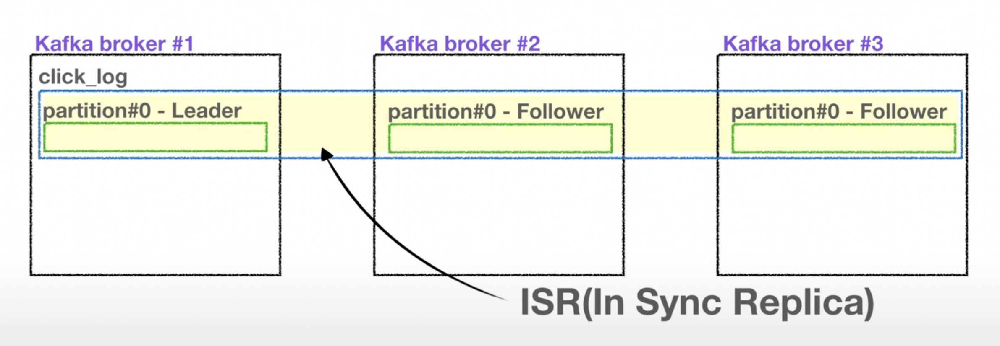

# Basic

## Kafka Cluster

- Broker 들의 집합이다.
- Partition을 최대한 각 Broker에 분산시켜 Load Balancing을 수행하고 Message 처리량도 높인다.

## Zookeeper

- Cluster를 이루는 각 Kafka Broker의 동작 상태를 파악하고 상태 정보를 Producer 및 Consumer에게 전달 한다.
- Kafka cluster로 통합 예정이다.

## Broker

- Message를 수신, 관리, 전송하는 Kafka의 핵심 Server이다.
- 3개 이상의 브로커를 구성하여 사용하는것을 권장 한다.

## Topic

- message를 구분하는 단위이다.
- 한 개의 topic은 한 개 이상의 partition으로 구성되어있다.

## Partition

- message를 저장하는 물리적인 파일이다.
- 여러개일 경우 partitioner의 정책에 따라 저장된다.
- 증가시킬 수는 있지만 줄일 수는 없다.
- 증가시키면 분산처리가 가능하다
- consumer가 데이터를 가져가도 데이터는 삭제되지 않고 다른 consumer가 져갈 수 있다.
  
  

## Partitioner

- producer 가 데이터를 보내면 partitioner를 통해서 broker로 전송된다.
- 레코드에 포합된 메시지 키, 값에 따라서 어떤 partition으로 보낼지 결정 한다.
- 기본 값은 **UniformStickyPartitioner**으로 key가 있으면 queue, 없으면 round robin 방식으로 전달한다.
  

## Replication

- partition을 복제한 개수를 나타낸다.
- replication은 broker의 개수를 초과할 수 없다.
- 원본을 Leader, 복사본을 Follower라고 부른다
- Leader partition이 죽으면 follower중 하나가 leader가 된다.
- kafka-client producer는 leader partition으로 데이터를 전달한다.
- 3개이상의 broker를 사용할 경우 replication은 3을 추천한다.
  
  

## In Sync Replica (ISR)

- Leader, Follower를 모두 포함하는 partition들을 ISR이라고 한다.
  

## Producer

- message를 생산(produce)하는 주체

## Consumer

- message를 소비(consume)하는 주체

## Reference

- [youtube: DevWonYoung](https://www.youtube.com/c/%EB%8D%B0%EB%B8%8C%EC%9B%90%EC%98%81DevWonYoung)
- [blog: kong-dahye](https://kong-dahye.tistory.com/13)
- [blog: ifuwanna](https://ifuwanna.tistory.com/487)
- [blog: judo0179](https://judo0179.tistory.com/112)
